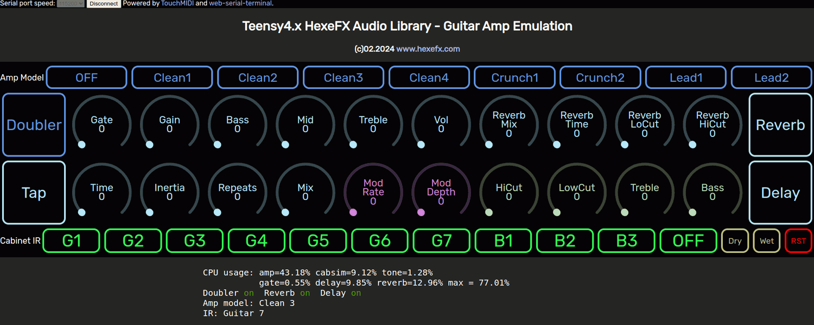

## HexeFX Guitar Amplifier Modeler for Teensy4.x  

This project combines various components from the `hexefx_audioLibrary_F32` with the RTNeural library to create a full guitar amp emulation on Teensy4.1.  
Internal signal flow:  

## Features  
- 8 amp/fx models + bypass
- Noise gate
- Stereo Spring Reverb emualtion
- 7 guitar cabinet IRs
- 3 bass guitar IRs
- Doubler function to create a wider stereo image out of a single guitar track  
- 3 band EQ
- MIDI/WebMIDI used as control interface

## Usage  
1. Open the project in the PlatformIO environment.
2. Depending on the used hardware, uncomment the `#define USE_TEENSY_AUDIO_BOARD` line.
3. Build the project and upload it to the Teensy4 board.
4. Open the `AmpModeler.html` file placed in the `Control_html` folder in Chrome, Chromium or Edge browser (others do not implement WebMIDI and WebSerial).
5. Connect to the USB MIDI interface listed as Teensy.  
6. Click `Connect` button on the top of the page and choose Teensy Serial port.
7. Use the dials and buttons to control the effect.  

  
  
  

## Controls  
- Amp Model buttons
- Gate - Noise gate threshold
- Gain, Bass, Mid, Treble - amp controls
- Vol - master volume
- Reverb Mix - dry/wet reverb mixer (allows to set 100% reverb sound)
- Reverb Time - decay time
- Reverb LoCut - input high pass filter for the reverb
- Reverb HiCut - reverb treble loss control
- Doubler - Cabsim stereo doubler on/off
- Cabinet IR - G1-7 guitar cabinets, B1-3 Bass cabinets, OFF - bypass
- Dry, Wet - analog Dry and Wet signal switches (T41.GFX pedal)
- RST - resets the Teensy

## Demo track recorded using this project 
  

## Credits  
The Neural Network Modeler is based on implementation by [Keith Bloemer/GuitarML](https://github.com/GuitarML/Seed)  

## Possible mods  
The SGTL5000 coedc chip used in the original Teensy Audio Adaptor board has a DSP section which could be used to expand the signal chain further:  
* use the built in 5 band EQ either as output tone control or input tone shaping/booster
* use the AGC circuit in limiter mode as compressor/limiter  

