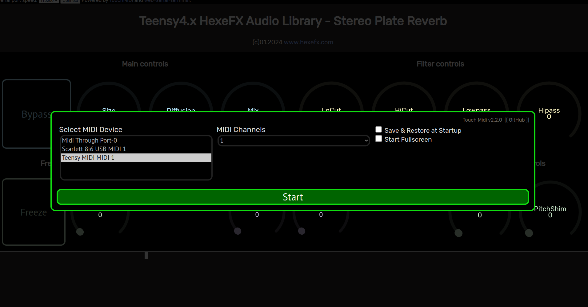
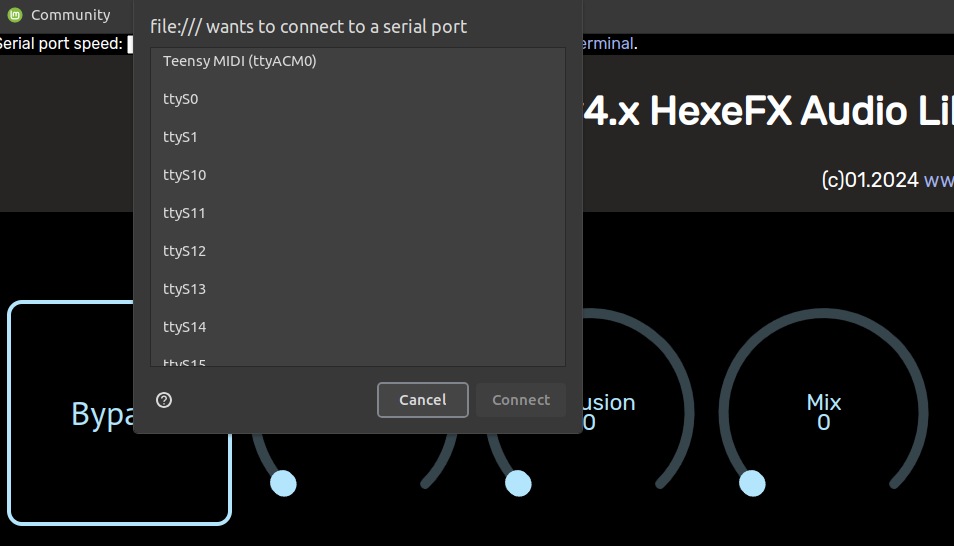
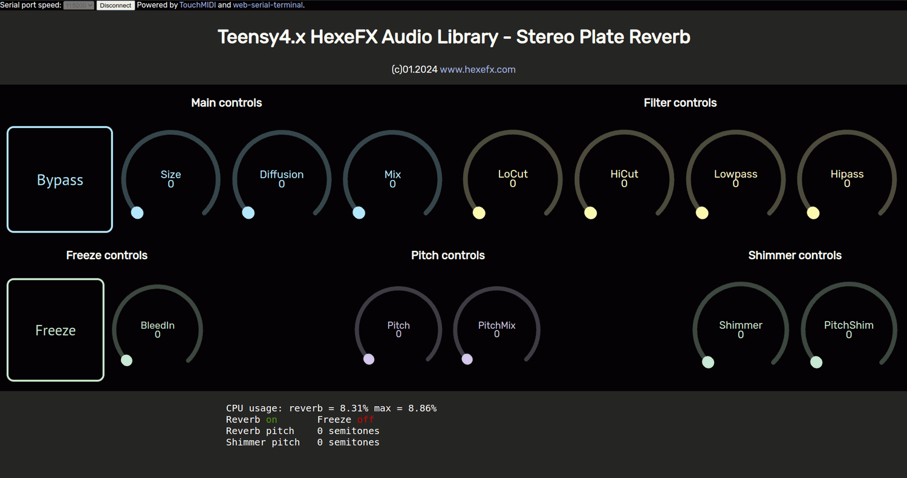

# HexeFX Plate Reverb Stereo for Teensy4.x  
Example PlatformIO project using the Plate Reverb component from the `hexefx_audioLibrary_F32`, which is an extension to the OpenAudio_ArduinoLibrary.  
## Usage  
1. Open the project in the PlatformIO environment.
2. Depending on the used hardware, uncomment the `#define USE_TEENSY_AUDIO_BOARD` line.
3. Build the project and upload it to the Teensy4 board.
4. Open the `PlateReverb.html` file placed in the `Control_html` folder in Chrome, Chromium or Edge browser (others do not implement WebMIDI and WebSerial).
5. Connect to the USB MIDI interface listed as Teensy.  
6. Click `Connect` button on the top of the page and choose Teensy Serial port.
7. Use the dials and buttons to control the effect.  
 
  
  
  

## Main Controls  
* **Bypass** button
* **Size** - reverb time
* **Diffusion** - lower values create more echo reflections in the reverb tail
* **Mix** - dry/wet mixer  

## Filter Controls  
* **LoCut** - reverb tail bass loss
* **HiCut** - reverb tail treble loss
* **Lowpass** - output treble control
* **Hipass** - output bass control  

## Freeze Controls
* **Freeze** On/Off button
* **BleedIn** - controls how much of the input signal is fed into the reverb tank while in Freeze mode 

## Pitch Controls
* **Pitch** - main pitch shifter applied to the whole reverb sound, range from -12 to +24 semitones
* **Pitch mix** - main pitch shifter dry/wet mixer  

## Shimmer Controls
* **Shimmer** - amount of shimmer effect applied to the reverb tail
* **PitchShim** - pitch setting for the Shimmer effect.  
  
## Demo  
    
