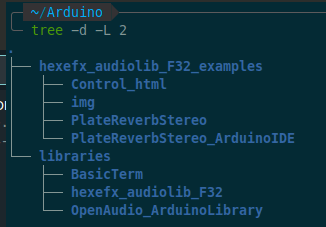

# hexefx_audiolib_F32_examples
Example projects for the [hexefx_audiolib_F32](https://github.com/hexeguitar/hexefx_audiolib_F32):  
### [Plate Reverb Stereo](https://github.com/hexeguitar/hexefx_audiolib_F32_examples/tree/main/PlateReverbStereo "Plate Reverb Stereo")  
  

## Using within Arduino IDE  
1. Locate the Arduino Sketchbook directory (path shown in Preferences)  
2. Enter the Sketchbook directory (ie. `/home/user/Arduino/)  
3. Create a new directory `libraries`  and enter it using a terminal or github CLI.
4. Clone the required libraries:  
   - `git clone https://github.com/nottwo/BasicTerm.git`  
   - `git clone https://github.com/chipaudette/OpenAudio_ArduinoLibrary.git` 
   - `git clone https://github.com/hexeguitar/hexefx_audiolib_F32.git`  
  
5. Restart Arduino IDE  
6. Open an `name_ArduinoIDE` example in the IDE.  
7. In Arduino IDE set the board to Teensy4.x  
8. Set the USB type as `Serial+MIDI`  
9. Build and upload the project.
___

Copyright 01.2024 by Piotr Zapart  
www.hexefx.com  
