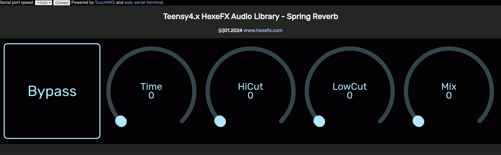

# HexeFX Stereo Spring Reverb for Teensy4.x  
Example PlatformIO project using the Spring Reverb component from the `hexefx_audioLibrary_F32`, which is an extension to the OpenAudio_ArduinoLibrary.  
## Usage  
1. Open the project in the PlatformIO environment.
2. Depending on the used hardware, uncomment the `#define USE_TEENSY_AUDIO_BOARD` line.
3. Build the project and upload it to the Teensy4 board.
4. Open the `SpringReverb.html` file placed in the `Control_html` folder in Chrome, Chromium or Edge browser (others do not implement WebMIDI and WebSerial).
5. Connect to the USB MIDI interface listed as Teensy.  
6. Click `Connect` button on the top of the page and choose Teensy Serial port.
7. Use the dials and buttons to control the effect.  
 
  
  

## Controls  
  
* **Bypass** button
* **Time** reverb time
* **HiCut** reverb tail treble loss
* **LoCut** input high pass filter
* **Mix** dry/wet mixer  
  
## Demo  
  
