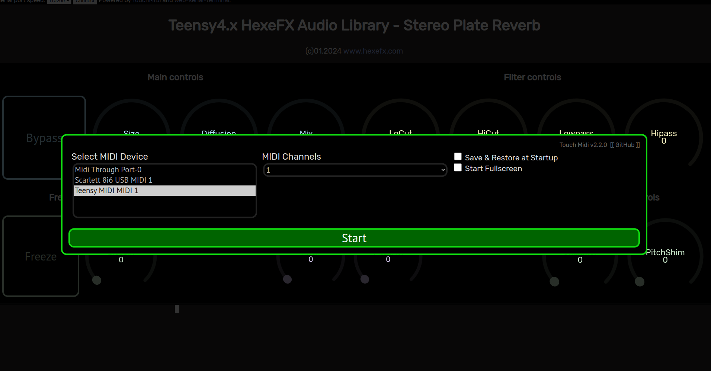
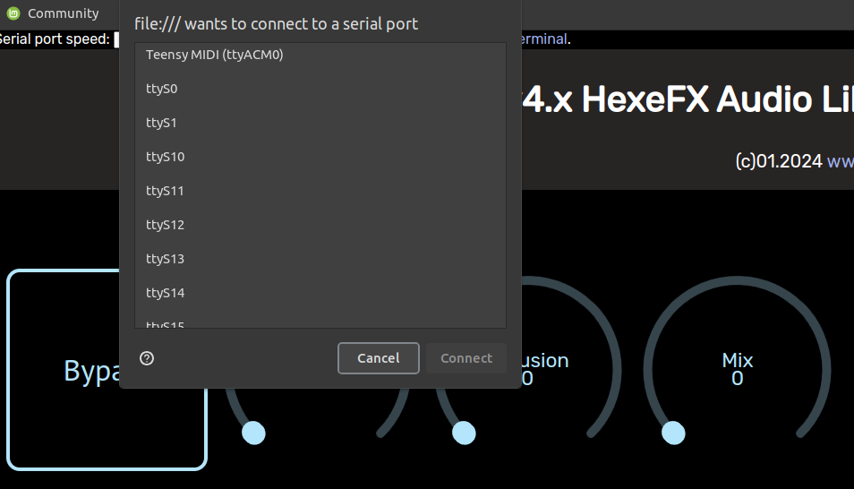
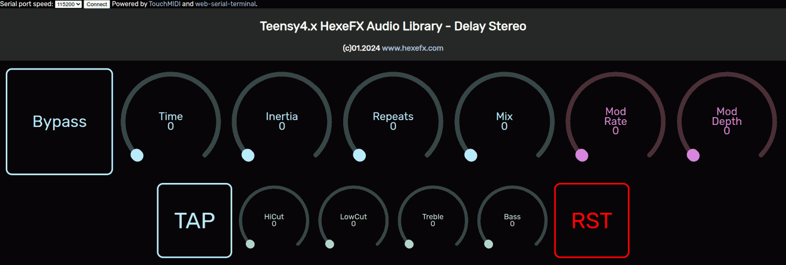

# HexeFX Stereo Ping-Pong Delay for Teensy4.x  
Example PlatformIO project using the Stereo Ping-Pong Delay component from the `hexefx_audiolib_F32`, which is an extension to the OpenAudio_ArduinoLibrary.  
## Usage  
1. Open the project in the PlatformIO environment.
2. Depending on the used hardware, uncomment the `#define USE_TEENSY_AUDIO_BOARD` line.
3. Build the project and upload it to the Teensy4 board.
4. Open the `StereoDelay.html` file placed in the `Control_html` folder in Chrome, Chromium or Edge browser (others do not implement WebMIDI and WebSerial).
5. Connect to the USB MIDI interface listed as Teensy.  
6. Click `Connect` button on the top of the page and choose Teensy Serial port.
7. Use the dials and buttons to control the effect.  
 
  
  

## Controls  
  
* **Bypass** button  
* **Time** Delay time  
* **Inertia** delay time update speed  
* **Repeats** delay feedback  
* **Mix** dry/wet mixer  
* **TAP** tap tempo button  
* **HiCut** delay treble loss  
* **LoCut** delay bass loss  
* **Treble** wet signal treble control  
* **Bass** wet signal bass control  
  
## Demo  
  
