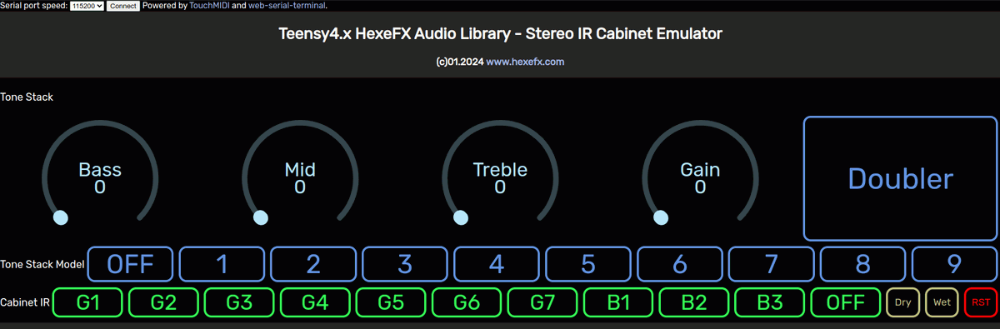

# HexeFX Stereo IR Cabinet Simulator for Teensy4.x  
Example PlatformIO project using the Stereo IR Cabsim and Guitar Tone Stack components from the `hexefx_audioLibrary_F32`, which is an extension to the OpenAudio_ArduinoLibrary.  
## Features  
- 7 guitar cabinet IRs
- 3 bass guitar IRs
- Doubler function to create a wider stero image out of a single guitar track  
- 9 Guitar Tone Stack models
## Usage  
1. Open the project in the PlatformIO environment.
2. Depending on the used hardware, uncomment the `#define USE_TEENSY_AUDIO_BOARD` line.
3. Build the project and upload it to the Teensy4 board.
4. Open the `StereoIRcabsim.html` file placed in the `Control_html` folder in Chrome, Chromium or Edge browser (others do not implement WebMIDI and WebSerial).
5. Connect to the USB MIDI interface listed as Teensy.  
6. Click `Connect` button on the top of the page and choose Teensy Serial port.
7. Use the dials and buttons to control the effect.  
 
  
  
  
## Demo  

