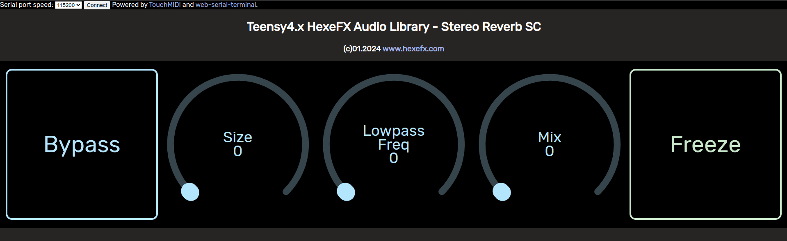

# HexeFX Stereo ReverbSC for Teensy4.x  
Example PlatformIO project using the reverbsc component from the `hexefx_audioLibrary_F32`, which is an extension to the OpenAudio_ArduinoLibrary.  
8 delay line stereo FDN reverb, based on work by Sean Costello.  
Optional PSRAM use for the delay buffers.  
## Usage  
1. Open the project in the PlatformIO environment.
2. Depending on the used hardware, uncomment the `#define USE_TEENSY_AUDIO_BOARD` line.
3. Build the project and upload it to the Teensy4 board.
4. Open the `ReverbSC.html` file placed in the `Control_html` folder in Chrome, Chromium or Edge browser (others do not implement WebMIDI and WebSerial).
5. Connect to the USB MIDI interface listed as Teensy.  
6. Click `Connect` button on the top of the page and choose Teensy Serial port.
7. Use the dials and buttons to control the effect.  
 
  
  

## Controls  
  

* **Bypass** button
* **Size** reverb time
* **Lowpass Freq** reverb tail treble loss
* **Mix** dry/wet mixer
* **Freeze** effect on/off 

## RAM usage  
This component is relatively RAM hungry, hence there are two versions available:  
1. Default model with reverb buffers placed in DMARAM (RAM2)
2. Optional external PSRAM memory (Teensy4.1) used for the buffers. Due to slower IO access the CPU load roughly doubles (6-7% vs 13%).  

## Demo 
  
